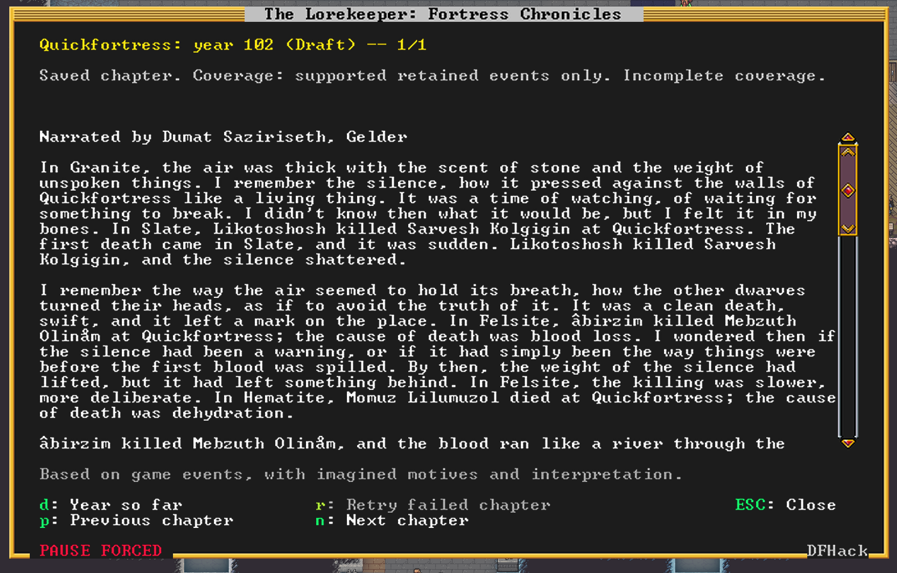
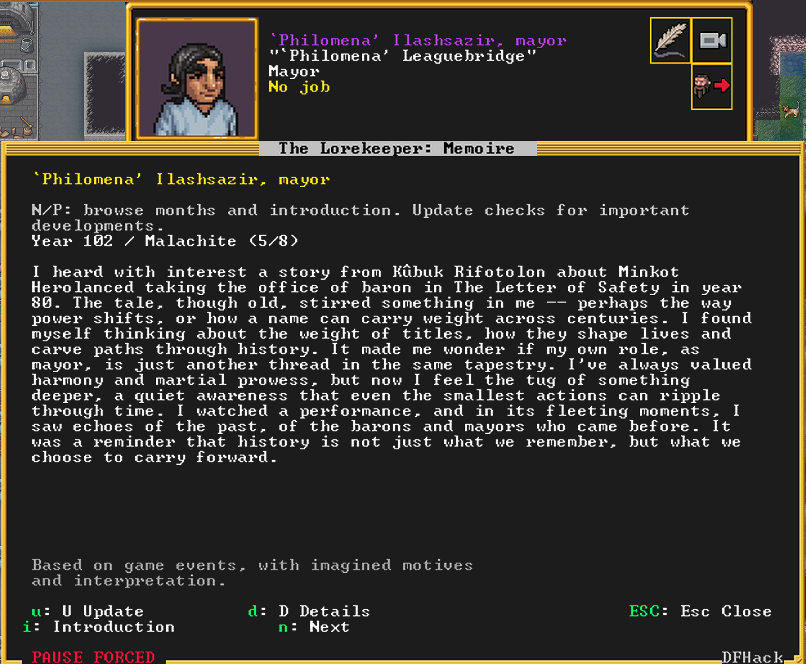
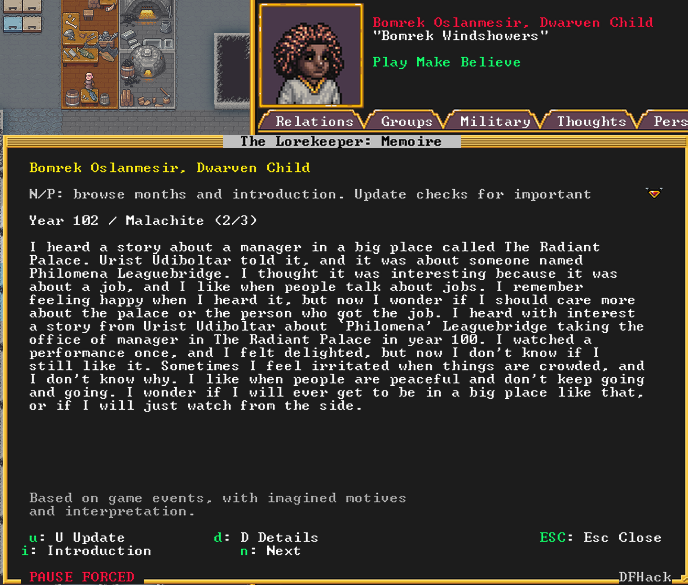
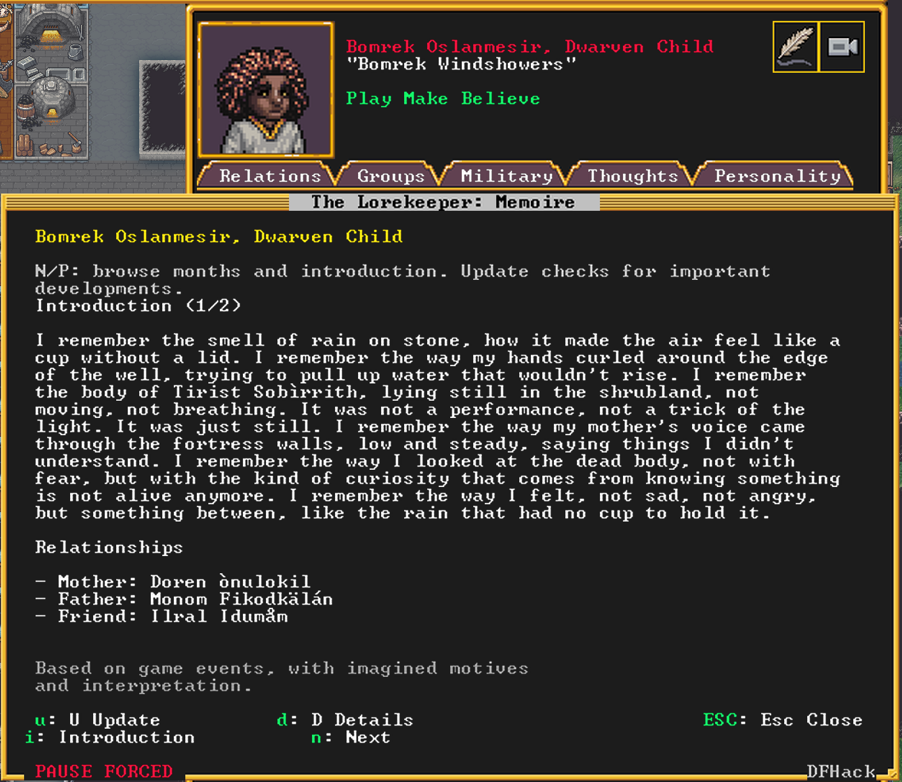

# The Lorekeeper

**Turn your fortress's lives and events into stories you can read without leaving Dwarf Fortress.**

## About Lorekeeper

Every dwarf in Dwarf Fortress has a history, but much of that history is easy to
miss while you are managing a fortress. Lorekeeper turns those small moments
into stories you can read inside the game.

Select a dwarf and open their Memoire to see the fortress through their eyes.
The first page is their **Introduction**—a glimpse of who they are, what matters
to them, and how they see the world. Their known family and friends appear
alongside it. As they live through more of fortress life, important experiences
become monthly chapters.

The stories are personal to each dwarf. A curious child may describe the same
fortress differently from a solemn veteran, and a dwarf who hears a tale may
remember it as something told to them rather than something they witnessed
themselves.

Lorekeeper also keeps a **Fortress Chronicle**. Each year, one living dwarf
becomes the voice of that year's account, describing the deaths, celebrations,
discoveries, performances, conflicts, and other moments that shaped the
fortress.

The stories appear in their own in-game readers, so you can return to them while
you play. Older chapters remain available as new ones are written, and a
separate history view lets you look back at the changes behind the stories.

Lorekeeper is currently a developer playtest for Steam Dwarf Fortress. It is
designed to make your fortress feel more personal, memorable, and alive.
**Back up your saves before testing.**

## Screenshots

### A Fortress Chronicle



### A Dwarf Memoire



### A Child Dwarf's Memoire



### An Introduction and Relationships



## Player setup (Windows)

You do not need to be a programmer to try Lorekeeper, but this is still an
early playtest. Install Steam Dwarf Fortress, DFHack, and [Ollama](https://ollama.com/download/windows).
Download or clone this repository into a folder you can find, such as
`C:\Users\YOUR_NAME\Lorekeeper`. In PowerShell, download the local writer once:

Install [Python 3.13 for Windows](https://www.python.org/downloads/windows/) if
the `python` command is not already available.

```powershell
ollama pull qwen3:8b
```

Start Ollama and leave it running. In the Dwarf Fortress folder, edit
`dfhack-config\script-paths.txt` and add the full path to this checkout's
`dfhack\scripts` folder, for example:

```text
+C:\Users\YOUR_NAME\Lorekeeper\dfhack\scripts
```

Then edit `dfhack-config\init\dfhack.init` and add:

```text
lorekeeper/autostart
```

Restart Dwarf Fortress after changing those two files. Open a fortress and start
the native worker from PowerShell in the checkout:

```powershell
.\helper\start_watcher.ps1 -Python python
```

Leave that window open while you play. Load a fortress, select a dwarf, and
press **Ctrl+L** (or click **Read Memoire**) to open the reader. Press **U** to
request an update. For fortress-wide stories, run `lorekeeper/chronicles` from
the DFHack launcher and press **D**. The first request can take a little while;
the game remains playable while the worker writes in the background.

To stop the worker, focus its PowerShell window and press Ctrl+C. Run only one
worker for a save directory. Keep regular backups of your save files. If the
reader says the worker is unavailable, confirm Ollama is running and that the
PowerShell window reports `writer ollama / qwen3:8b`.

Standalone guides: [Windows player setup](docs/setup-windows.md) and
[Linux player setup](docs/setup-linux.md).

## How it works

| Component | Runs where | Responsibility |
| --- | --- | --- |
| DFHack Lua scripts | Windows game | Bounded collection, on-demand profiles, overlays and readers |
| Save-directory watcher | Windows or WSL | Prepare timelines, invoke the selected model, validate/cache stories |
| Ollama (local) | Windows | Local Qwen generation outside the game loop |

There are **two separate startup mechanisms**: DFHack starts collection on fortress load; you start the watcher separately (manually or with an optional task). The watcher does **not** currently launch with DFHack. Once both run, reading and updates happen entirely in-game—no manual queue processing.

## Windows developer installation

Verified development setup: Steam DF **0.53.16**, DFHack **53.16-r1.1**, Windows Python **3.13**. Other game/DFHack versions require compatibility testing. Python code uses 3.10+ syntax and standard-library modules only. The native Windows watcher is the recommended setup.

Commands are labeled **PowerShell**, **WSL**, or **DFHack**. Copy commands only, not terminal prompts such as `PS C:\Users\...>` or error output.

### 1. Install DFHack and Windows Python

Install Steam Dwarf Fortress and its matching DFHack. Launch the game once with DFHack, load a fortress, and check that **Ctrl+Shift+D** opens the DFHack launcher (backtick is another default binding). Exit DF before editing its startup configuration.

Find the actual game directory through Steam's **Manage → Browse local files**. The usual location is:

```text
C:\Program Files (x86)\Steam\steamapps\common\Dwarf Fortress
```

Use your actual Steam library path throughout. Configuration belongs in the **Dwarf Fortress** folder, not the separate **DFHack** folder.

No WSL installation is required for the Windows player workflow. No compiled
plugin, Python packages, HTTP API server, or web server are needed.

### 2. Download one checkout

Download or clone the repository into a stable Windows folder. If Git is
installed, PowerShell can use:

```powershell
git clone https://github.com/DerPdeFeNdeR/dwarf-fortress-lorekeeper.git "$env:USERPROFILE\Lorekeeper"
cd "$env:USERPROFILE\Lorekeeper"
python --version
```

Do not run a second worker from another checkout against the same save directory.

### 3. Install Ollama and download the local model

For the native Windows worker used by the current player workflow, see
[native Windows startup](helper/README.md#native-windows-startup-ollama).
The WSL and native workers must never run against the same save root together.

Install Ollama for Windows, start it, and download the model:

```powershell
ollama pull qwen3:8b
```

The watcher uses Ollama at `http://127.0.0.1:11434` by default. It sends
schema-constrained JSON, disables Qwen thinking for latency, and keeps the model
loaded between requests. See [worker configuration](helper/README.md#configuration).

### 4. Connect the checkout to DFHack

Back up configuration files first; preserve existing contents. Create missing files/directories as needed. Your editor may need elevation to save under `Program Files`; do not broadly change folder permissions.

Edit this file under the **Dwarf Fortress** installation:

```text
dfhack-config\script-paths.txt
```

Add one line using your actual **Windows** checkout path:

```text
+C:\Users\YOUR_WINDOWS_USER\projects\dwarf-fortress-lorekeeper\dfhack\scripts
```

Keep the leading `+`; no quotes, `/mnt/c/...`, or environment-variable placeholders in this file. Paste the actual path. Avoid accidentally saving `script-paths.txt.txt`.

Next edit:

```text
dfhack-config\init\dfhack.init
```

The **`init` subdirectory matters**. Add once:

```text
lorekeeper/autostart
```

This starts citizen collection, supported-event indexing, the annual monitor and environmental observations when a fortress loads. It does not start the worker; add it separately if needed. **Fully restart Dwarf Fortress after these configuration changes.** See [DFHack's configuration reference](https://docs.dfhack.org/en/stable/docs/Core.html#configuration-files).

### 5. Start the watcher for a first test

Load a fortress once so the game's `save` directory exists. The recommended
native Windows command is run from the repository root in **PowerShell**:

```powershell
.\helper\start_watcher.ps1 -Python python
```

For WSL, use this command from the repository root in **WSL**:

```bash
python3 helper/watch_save_directory.py "/mnt/c/Program Files (x86)/Steam/steamapps/common/Dwarf Fortress/save"
```

Use the parent **`save` directory**, not `region1` or `region3`. Leave this terminal open while playing; it reports startup and errors. **Ctrl+C** stops it. Run only one watcher for this save root—stop this foreground process before starting the scheduled task below.

The worker checks every five seconds between work cycles. Generation may take seconds or longer, especially with other jobs pending, but never waits inside DFHack. Model work continues while the game is paused.

### 6. Test in-game

Open the **DFHack launcher** with Ctrl+Shift+D and run individually:

```text
lorekeeper/test
lorekeeper/collect status
lorekeeper/environment
```

Expect tests to pass (115 at this checkpoint), collector `running`, and observer status. Play **unpaused** briefly, then repeat `lorekeeper/collect status`: scanned counts should advance. Unchanged counters while paused are normal. If autostart is missing, correct step 4; running `lorekeeper/autostart` activates it for the current session.

Open a dwarf's unit sheet and run:

```text
lorekeeper/memoire
```

Or click **Read Memoire** on its Lorekeeper panel / press **Ctrl+L**. A factual fallback or previous prose remains while the worker writes. The window updates automatically; close it and keep playing if you prefer.

For fortress-wide history, no dwarf selection is needed:

```text
lorekeeper/chronicles
```

Press **D — Year so far** for a draft. A fresh installation has no collected history; it cannot reconstruct complete past years, though supported historical events may still be available from the game.

### 7. Optional: start the watcher at Windows logon

After the foreground test works, stop it with Ctrl+C. In **PowerShell under the Windows account you play with**, set paths (repeat in a new shell):

```powershell
$LorekeeperProject = Join-Path $env:USERPROFILE 'projects\dwarf-fortress-lorekeeper'
$LorekeeperSave = 'C:\Program Files (x86)\Steam\steamapps\common\Dwarf Fortress\save'
```

Adjust both as needed. Validate without registering:

```powershell
powershell.exe -NoProfile -ExecutionPolicy Bypass -File "$LorekeeperProject\helper\install_watcher_task.ps1" -ProjectPath "$LorekeeperProject" -SaveDirectory "$LorekeeperSave" -WhatIf
```

`-WhatIf` checks path conversion/task construction, **not** Python, authentication, model access, or actual watcher execution. Register:

```powershell
powershell.exe -NoProfile -ExecutionPolicy Bypass -File "$LorekeeperProject\helper\install_watcher_task.ps1" -ProjectPath "$LorekeeperProject" -SaveDirectory "$LorekeeperSave"
```

This creates/replaces **Lorekeeper Queue Watcher**, an optional WSL startup task.
The native Windows player workflow uses the foreground PowerShell command above;
it does not require this task. Execution-policy bypass applies only to that
PowerShell invocation. If registration reports **Access is denied**, reopen
PowerShell **as administrator for the same Windows user**, repeat the path
assignments and rerun. Another administrator account may use different WSL
credentials.

Registration does **not** start the task immediately. Start/check it now in **PowerShell**:

```powershell
Start-ScheduledTask -TaskName 'Lorekeeper Queue Watcher'
Start-Sleep -Seconds 5
Get-ScheduledTask -TaskName 'Lorekeeper Queue Watcher' | Select-Object TaskName, State
wsl.exe -- ps -ef | Select-String 'watch_save_directory.py'
```

Expect `Running` and one Python watcher process. `Ready` means it is not currently running. Sign out/in or restart Windows once and repeat the checks to verify automatic startup; no manual start should then be necessary.

The task starts at **Windows logon**, not game launch, and can remain running after DF closes. The wrapper logs to `${XDG_STATE_HOME:-$HOME/.local/state}/lorekeeper/watcher.log` in WSL. With the default location:

```bash
tail -n 40 ~/.local/state/lorekeeper/watcher.log
```

## Playing

| Reader | Controls |
| --- | --- |
| `lorekeeper/memoire` | U: request update; I: introduction; N/P: months; D: details; Escape: close |
| `lorekeeper/chronicles` | D: year-so-far draft; N/P: chapters; R: retry failed chapter; Escape: close |
| `lorekeeper/history/show` | Technical timeline; R: reread prepared results, not recapture; N/P: pages |

Scroll with arrow keys, Page Up/Down, or mouse wheel. To switch dwarves, close, select another, and reopen. `lorekeeper/show` is an older current-state summary, not the Memoire reader.

Monthly chapters revise in place when important evidence changes; opening repeatedly does not append paragraphs. Quiet months generate no filler. Finished annual chapters are immutable. Coverage failure preserves previous prose; annual failures permit one bounded correction before reporting failure.

## Updating and developing

In the shared checkout, **WSL** (preserve local edits before pulling):

```bash
git status
git pull --ff-only
PYTHONDONTWRITEBYTECODE=1 TMPDIR=/dev/shm python3 -m unittest discover -s helper -p 'test_*.py'
```

Checkpoint: 176 Python tests, 169 passed / seven opt-in live tests skipped. Run `lorekeeper/test` after Lua changes. Live tests use model access; see [helper testing](helper/README.md#testing).

- **Python changes:** restart the foreground watcher or scheduled task; do not start a duplicate.
- **Lua changes:** close/rerun the command first; restart DF if modules do not reload. New overlay discovery can use `:lua require('plugins.overlay').rescan()` in DFHack.
- **Script-path changes:** fully restart DF. Initialization edits need a restart to verify future autostart.
- **Documentation-only changes:** no restart.

Restart the task in **PowerShell**:

```powershell
Stop-ScheduledTask -TaskName 'Lorekeeper Queue Watcher'
Start-Sleep -Seconds 2
Start-ScheduledTask -TaskName 'Lorekeeper Queue Watcher'
```

## Troubleshooting

| Symptom | Check |
| --- | --- |
| Unknown command | Use `lorekeeper/test`, not `lorekeeper test` or `lorekeeper/tests`. Check the script path and restart DF. |
| Missing button | Try the command, then `gui/overlay`; saved enable/position preferences are respected. |
| Collector counters unchanged | Unpause. After `collect stop`, use `collect start` to resume this session. |
| Historian offline/pending | Check Ollama, the native Python process, and the watcher log. |
| Task Ready after logon | Inspect `Get-ScheduledTaskInfo -TaskName 'Lorekeeper Queue Watcher'` and the watcher log. Manual start is a diagnostic, not the desired permanent workflow. |
| Another worker owns the save root | Stop the duplicate worker/task; do not delete the lock file to bypass ownership. |
| Save-path error | Verify Steam location, existing `save` directory and write permission; keep the whole path in one quoted argument. |
| Chronicle coverage failure | Prior prose is preserved. R retries the failed request; D requests newer evidence. Keep the error IDs for reporting. |
| No significant developments | U checks evidence; minor/unchanged input intentionally reuses saved prose. |
| Game paused while writing | Model work uses real elapsed time. Only simulation-driven collection requires unpaused game time. |

## Data, privacy, and disabling

Files live beside saves: `lorekeeper-history.jsonl`, `lorekeeper-history-index/`, `lorekeeper-views/`, `lorekeeper-chronicles/`, and `lorekeeper-environment/`. The save root also has a worker heartbeat/lock. Back up the full region folder **including sidecars**; deleting caches can lose generated prose. Reloaded saves can have separate recording branches.

Structured game information—including names, relationships, and events—is sent to
the local model provider. This is **not fully offline** in every configuration.
Credentials stay outside Lua/save files. Never commit credentials, private save
data, generated profiles or rejected drafts to this public repository. The HTTP
API prototype is not used by these readers.

To disable, stop the scheduled task with `Stop-ScheduledTask -TaskName 'Lorekeeper Queue Watcher'`, then use `Disable-ScheduledTask -TaskName 'Lorekeeper Queue Watcher'`. Remove only the Lorekeeper lines added to `script-paths.txt` and `init/dfhack.init`, and restart DF. Keep saved data if you may return. Stopping only the citizen collector does not stop the separate annual/environment monitor.

## More documentation

- [DFHack commands](dfhack/README.md) and [worker configuration/utilities](helper/README.md)
- [Current roadmap](PLAN.md), [data contracts](docs/schema.md), [model boundary](docs/translation.md)
- [Documentation index](docs/README.md), [decisions](docs/decisions/README.md), [historical test notes](docs/notes/README.md)
- [Agent instructions](AGENTS.md) and [next-session handoff](HANDOFF.md)

Evidence is bounded, not exhaustive: annual selection includes up to 16 supported local events and four storytelling incidents. Initial indexing/generation can take time. Weather is sampled, not reconstructed; moon phases remain unavailable. Natural year rollover, mixed-biome weather, other installations and extended play remain validation areas. No SQLite/web viewer, packaged installer or DFHack-launched watcher is implemented yet.
